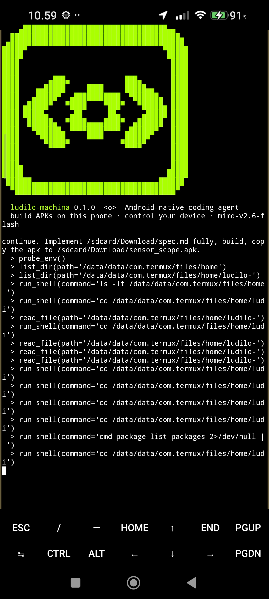
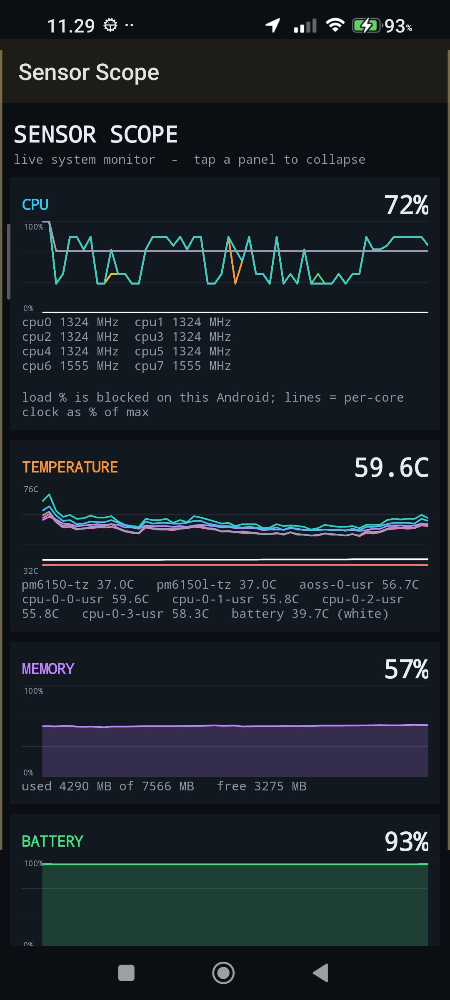
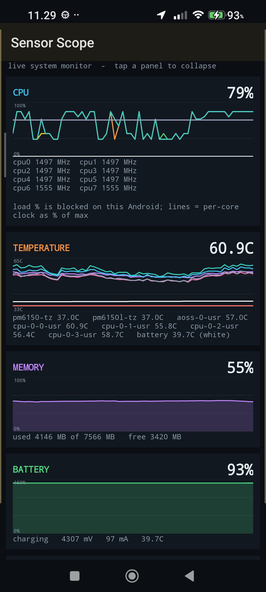
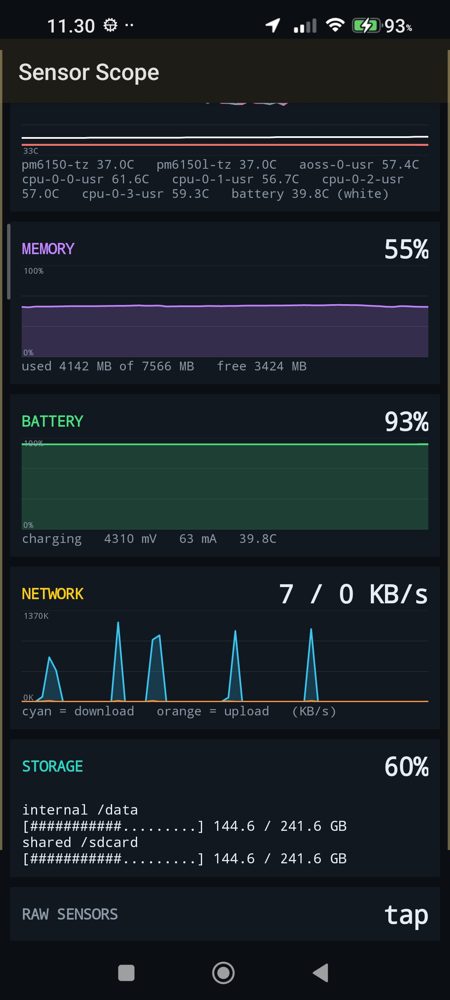

# ludilo-machina

**Website:** https://dusancar-sudo.github.io/ludilo-machina/

A coding agent that runs **inside Termux on Android**. It writes Android apps, packs them into signed
APKs **on the phone**, installs them, launches them, looks at the screen/logs, and fixes what broke.

## Status (v0.1, honest)
- Done and tested on a desktop: agent loop, tool dispatch, user limits (allow-all default), splash from the logo, action log, project template.
- Written but **not yet run on a phone**: APK pipeline (`ludilo/apk.py`), device tools (adb/Termux:API), `scripts/setup.sh`.

## Example: Sensor Scope
A real app built on the phone: live CPU / temperature / memory / battery / network / storage graphs.
Source in [`examples/sensor_scope`](examples/sensor_scope). [Watch it run (17 s)](assets/sensor-scope/demo.mp4).

  

## Run (in Termux)
    sh scripts/setup.sh
    python -m ludilo config      # base URL / model / key (any OpenAI-compatible API)
    python -m ludilo "make a flashlight app and install it"

## Tools the agent has
files/shell, `probe_env`, `new_android_project`, `build_apk`, `install_apk`, `launch_app`,
`screenshot`, `ui_dump`, `logcat`, `device_input`, `device_settings`, `termux_api`.
**Everything is allowed by default.** Users add their own limits:

    ludilo limits                          # show
    ludilo limits deny device_settings     # block a tool (globs ok: device_*)
    ludilo limits confirm install_apk      # ask before each use
    ludilo limits deny_shell "rm -rf"      # block shell commands containing this
    ludilo limits allow device_settings    # remove a limit

Chats are saved automatically: `ludilo continue` resumes the latest, `ludilo resume` shows a list (or `ludilo resume 2`).
`ludilo status` shows model, key, toolchain, limits and token totals (today / all time; session total prints on exit).
Every action is logged to `~/.ludilo/actions.log`.

See docs/ARCHITECTURE.md and docs/APK-ON-DEVICE.md.
